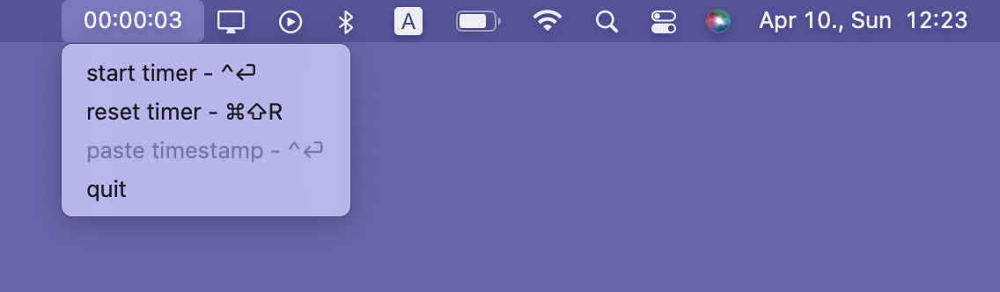
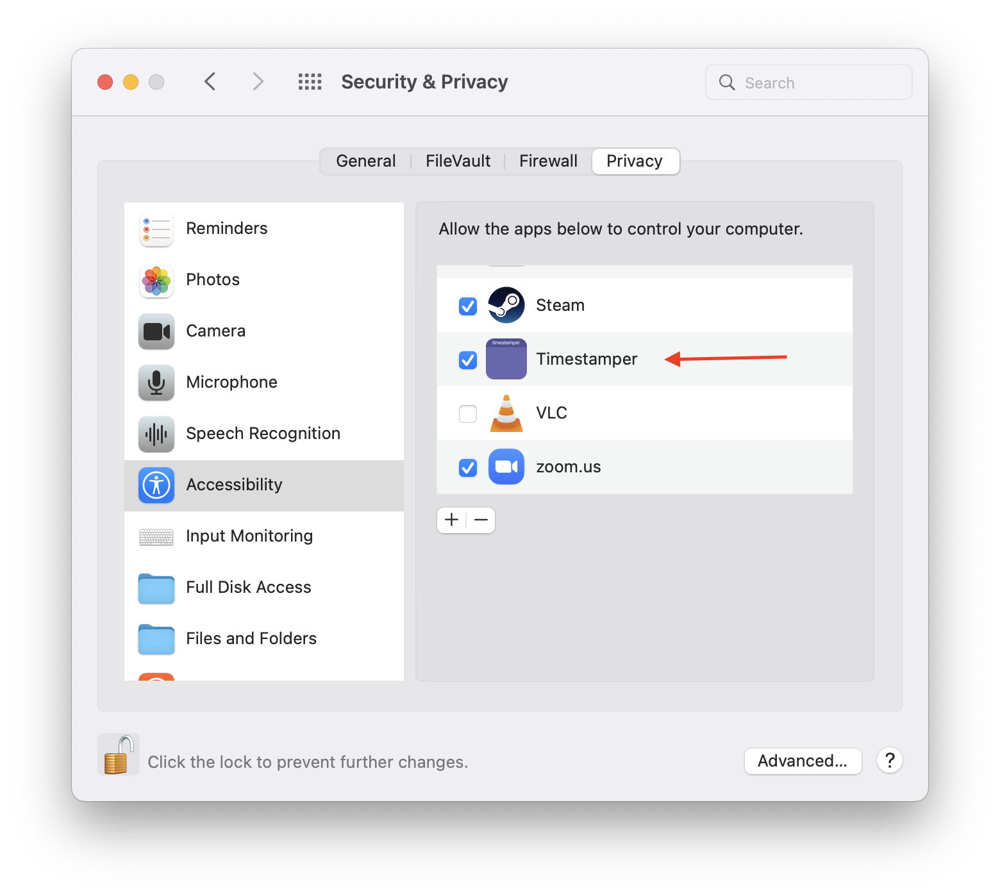
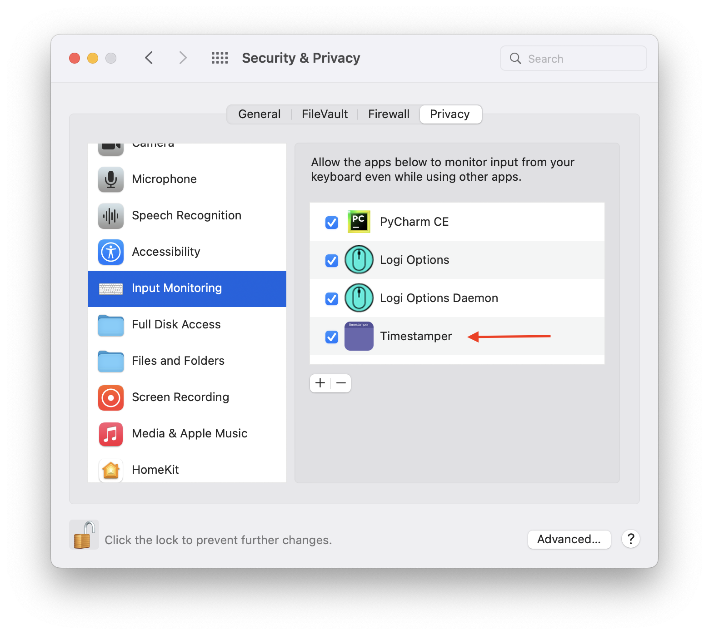

# timestamper

Timestapmer is a status bar timer which lets you paste timestamps using 
the ctrl + enter shortcut.

## install

1. Download the latest version from 
[https://github.com/foltri/timestamper/releases/latest](https://github.com/foltri/timestamper/releases/latest)
2. Extract and copy to Applications folder

3. In order to make it work, 
   - enable Timestamper in Settings, Security and Privacy, Accessibility:
   
   - enable Timestamper in Settings, Security and Privacy, Input monitoring:
   
